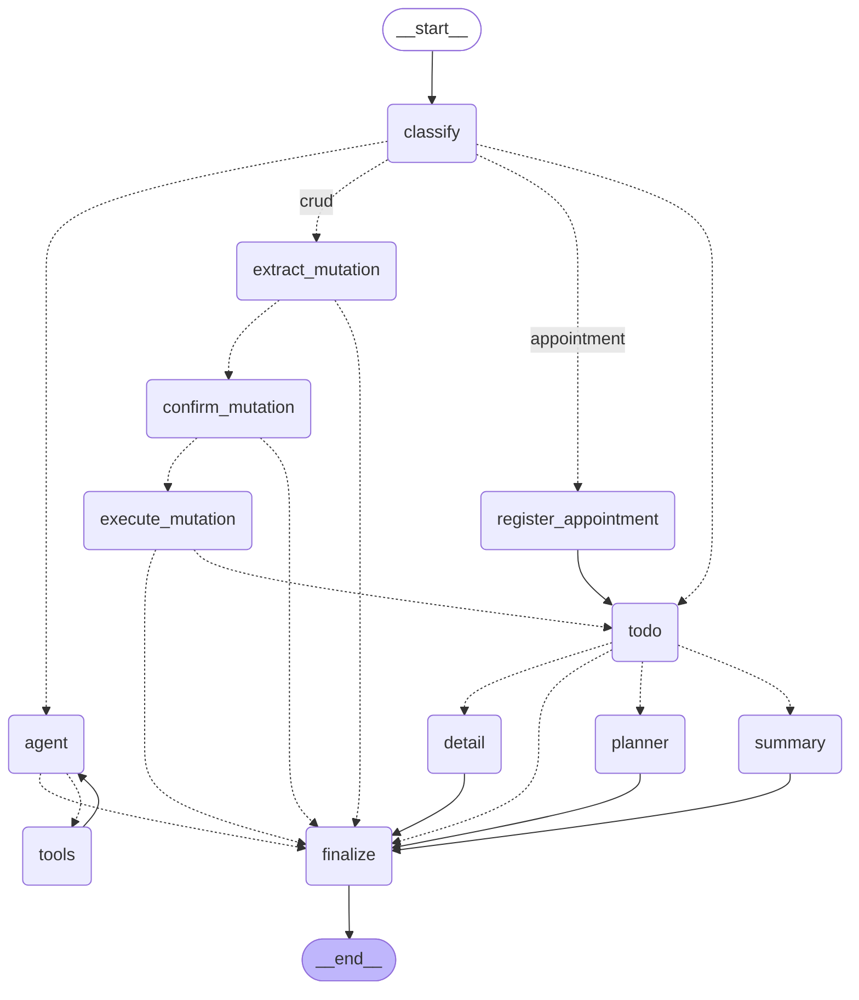

# To-do Agent — Architecture & Graph Guide

A local, skill-aware AI task assistant. It runs against a local
[Ollama](https://ollama.com) model, stores tasks through an
[MCP](https://modelcontextprotocol.io) server, reasons with a
[LangGraph](https://langchain-ai.github.io/langgraph/) multi-agent graph, and is
driven by a [Streamlit](https://streamlit.io) chat UI.

This document explains the **project structure**, the **building blocks**, and —
in detail — the **planner graph**: every node, every edge, and the state that
flows between them.

> Bản tiếng Việt: [ARCHITECTURE.vi.md](ARCHITECTURE.vi.md).

---

## 1. Big picture

```
┌──────────────┐   prompt    ┌───────────────────────┐
│  Streamlit   │ ──────────► │   GraphOrchestrator    │   (LangGraph StateGraph)
│  chat UI     │             │  classify → … → final  │
│ (ui/*.py)    │ ◄────────── │  ⏸ interrupt for human │
└──────────────┘   answer /  └───────────┬───────────┘
        ▲          approval               │ calls
        │ review                          ▼
        │ table          ┌──────────────────────────────────┐
        └─── approve ───►│ Agents & capabilities             │
             / edit      │  • TodoAgent      (read/normalize)│
                         │  • DailyPlanner   (plan the day)  │
                         │  • mutation parser/executor (CRUD)│
                         │  • tool-calling agent loop        │
                         └───────────┬───────────┬──────────┘
                                     │            │
                              ┌──────▼─────┐ ┌────▼──────┐
                              │ Ollama LLM │ │ MCP server│
                              │(llm_client)│ │ (tasks)   │
                              └────────────┘ └───────────┘
```

Two ideas hold the system together:

1. **A typed contract** (`models/contract.py`) is the only thing that crosses
   agent boundaries. Free text and unvalidated JSON never flow downstream — a
   malformed task fails loudly at the boundary instead of corrupting a plan.
2. **The control flow is a graph.** Each step is a node, routing is edges, and
   the shared state is a typed `TypedDict`. Mutations are gated by a human via a
   LangGraph `interrupt`.

There are **two orchestrators**:

| Orchestrator | File | Style | Used by |
|---|---|---|---|
| `GraphOrchestrator` | `agents/graph_orchestrator.py` | LangGraph `StateGraph` | **the app** (Planner mode) |
| `Orchestrator` | `agents/orchestrator.py` | plain-Python `match` | reference / tests |

Both reuse the *same* agents and formatters; only the control-flow shell
differs. Everything below describes the graph orchestrator.

---

## 2. Directory structure

```
src/
├── app.py                     # Streamlit entrypoint: load skills + MCP tools, render UI
├── run_orchestrator.py        # offline demo CLI (sample tasks, deterministic — no Ollama/MCP)
├── visualize_graph.py         # dump the graph as Mermaid / ASCII / PNG
│
├── configs/
│   └── settings.py            # env-driven config (model, MCP URL, checkpoint DB, TRACE)
│
├── models/
│   ├── contract.py            # THE contract: Task, TaskList, TaskMutation, DayPlan, …
│   └── skill.py               # Skill dataclass (name, description, body)
│
├── agents/
│   ├── graph_orchestrator.py  # the LangGraph multi-agent graph (this doc's focus)
│   ├── orchestrator.py        # plain hub-and-spoke + factories + intent rules + formatters
│   ├── todo_agent.py          # data specialist: fetch → normalize → validated TaskList
│   ├── planner_agent.py       # reasoning specialist: TaskList → DayPlan (+ LLM planner)
│   ├── human_in_the_loop.py   # wrap mutating tools so they need approval
│   └── ollama_agent.py        # single tool-calling agent + skills (Streaming/Normal modes)
│
├── core/
│   ├── services/
│   │   ├── llm_client.py       # create_ollama_model(...) — ChatOllama factory
│   │   ├── mcp_client.py       # MultiServerMCPClient → LangChain tools
│   │   ├── checkpoint.py       # checkpointer opener (SQLite or in-memory)
│   │   ├── prompts.py          # load_prompt("name") from src/prompts/*.md
│   │   └── skills.py           # discover + load SKILL.md files
│   └── tools/
│       ├── common_tools.py     # local @tool helpers (e.g. get_today_date)
│       └── skill_tools.py      # get_skill_detail tool
│
├── ui/
│   ├── main_view.py            # chat, the human-in-the-loop review table, streaming
│   └── sidebar.py              # model / temperature / mode controls
│
├── prompts/                    # system prompts (markdown)
│   ├── intent_classifier_system.md
│   ├── todo_agent_system.md    # normalization
│   ├── crud_agent_system.md    # mutation parsing
│   ├── planner_agent_system.md # LLM day planning
│   ├── complex_agent_system.md # the agent⇄tools loop
│   └── agent_system.md         # single-agent (ollama_agent) mode
│
└── utils/
    └── json_utils.py           # JSON helpers

tests/                          # pytest suite (contract, agents, graph, runtime)
```

---

## 3. Core elements

### 3.1 The contract — `models/contract.py`

The linchpin. Every model is typed, bounded, and `extra="forbid"`.

| Model | Role |
|---|---|
| `Task` | A normalized task ready to plan: `id, title, priority, est_minutes (0<…≤480), category, due?`. |
| `TaskList` | The validated collection that crosses the TodoAgent → Planner boundary. |
| `Priority` | `high / medium / low` enum with a `rank` for sorting. |
| `Status` | `pending / in_progress / done` (mirrors the MCP server). |
| `CrudOp` | `create / update / delete`. |
| `TaskMutation` | A validated write request. Its `@model_validator` enforces: create needs a `title`; update/delete need a `task_id`; update needs ≥1 changed field. This is the **CRUD checkpoint**. |
| `TimeBlock` / `MealBreak` / `DayPlan` | The planner's **output** as typed data: scheduled `blocks`, `breaks`, and `deferred` tasks, plus `available_minutes` and `overloaded`. |

### 3.2 Agents

- **`TodoAgent`** (`todo_agent.py`) — the *data specialist*. `run()` fetches raw
  tasks (via an injected fetcher over the MCP tools) and normalizes them into a
  validated `TaskList`, retrying on bad output. `parse_mutation()` turns a write
  request into a validated `TaskMutation` (LLM or heuristic), accepting an
  optional `focus_task_id` so a follow-up like "mark it done" resolves to the
  last-referenced task.
- **`DailyPlannerAgent` / `plan_day` / `llm_plan_day`** (`planner_agent.py`) —
  the *reasoning specialist*. `plan_day` is deterministic: rank tasks, fit them
  into the working window **around breaks**, defer the overflow. `llm_plan_day`
  asks the model for the whole `DayPlan` (structured output) and validates it
  (types **and** semantics — in-window, no overlaps, every task accounted for).
  `make_planner` (in `orchestrator.py`) wraps the LLM with retries and a
  **deterministic fallback**, so a valid plan is always returned. Also here:
  `parse_workday` ("I work 7am–11pm"), `parse_appointment` ("dinner 17:30–19:30"),
  and `workday_with_appointments`.
- **Mutation parser / executor** (`orchestrator.py`) — `make_mutation_parser`
  produces a `TaskMutation`; `make_mutation_executor` applies it via the MCP
  write tools (an update may touch several endpoints).
- **`human_in_the_loop.py`** — `wrap_mutating_tools` wraps any create/update/
  delete tool so it `interrupt`s for approval before running (used on the agent
  loop path).

### 3.3 Services & tools

- `llm_client.create_ollama_model(name, temperature, format=schema, …)` — the
  one place a model is built; `format` enables structured output.
- `mcp_client` — connects to the MCP server(s) and returns LangChain tools.
- `checkpoint.make_checkpointer_opener(db)` — persistent SQLite saver (or
  in-memory for tests). Required for interrupt/resume.
- `prompts.load_prompt(name)` — reads `src/prompts/<name>.md`.
- `skills` + `skill_tools` + `common_tools` — progressive-disclosure skills and
  small local tools (e.g. `get_today_date`, `plan_my_day`, `summarize_tasks`).

### 3.4 UI

`app.py` wires skills + MCP tools and calls `ui/main_view.render_main_view`.
In **Planner mode**, the main view drives `GraphOrchestrator.start/resume`. When
the graph pauses for approval it renders an **editable review table**
(`_render_approval_panel`): create shows all fields, update shows only the
changed fields, delete just confirms; edits are validated against `TaskMutation`
before resuming, and the chat is locked until the review is resolved.

---

## 4. The graph

### 4.1 Shared state — `PlannerState`

The `TypedDict` that flows along every edge:

| Field | Meaning | Lifetime |
|---|---|---|
| `user_input` | the current prompt | per turn |
| `date` | today's date (ISO) | per turn |
| `intent` | classification result (see §4.4) | per turn |
| `tasks` | validated `TaskList` as a plain dict | per turn |
| `mutation` | validated `TaskMutation` as a plain dict | per turn |
| `approved` | the human's decision from `confirm_mutation` | per turn |
| `notice` | success line prepended to the final result | per turn |
| `result` | the text shown to the user | per turn |
| `error` | a recoverable error message | per turn |
| `messages` | append-only chat log (`add_messages`) — conversation memory | **persists** |
| `focus_task` | `{id,title}` of the last task viewed/acted on | **persists** |
| `appointments` | list of `{name,start,end}` fixed-time commitments | **persists** |
| `work_hours` | `{start,end}` last stated working hours | **persists** |

`start()` resets the per-turn fields each turn; the four "persists" fields are
**not** reset, so they carry across turns via the checkpointer (keyed by
`thread_id`). That is what makes "change its category", "replan today", and the
remembered dinner appointment work conversationally.

### 4.2 Graph diagram

```
                            ┌──────────┐
                START ─────►│ classify │
                            └────┬─────┘
                   route_by_intent│
   ┌───────────────┬─────────────┼──────────────┬────────────────────┐
   │ appointment   │ plan/summary │ add/update/   │ complex/unknown/   │
   │               │ /detail      │ delete (crud) │ weather            │
   ▼               ▼              ▼               ▼
┌──────────────┐  ┌──────┐   ┌───────────────┐  ┌───────┐
│ register_    │  │ todo │   │extract_mutation│  │ agent │◄────┐
│ appointment  │  └──┬───┘   └──────┬────────┘  └──┬────┘     │
└──────┬───────┘     │ route_after_  │route_after_  │ should_   │tools→agent
       │ (edge)      │ todo          │extract       │ continue  │ (loop)
       └────────────►│               │              │           │
                     │     ┌─────────┴───┐    ┌─────┴────┐  ┌────┴───┐
        ┌────────────┼─────┤             │    │ tool_    │  │ tools  │
        │ summary    │ detail            ▼    │ calls?   ├─►│(ToolNode)
        ▼            ▼     │     ┌──────────────┐         │  └────────┘
   ┌────────┐  ┌────────┐ │     │confirm_       │ ⏸ interrupt
   │summary │  │ detail │ │     │mutation       │ (human approval)
   └───┬────┘  └───┬────┘ │     └──────┬───────┘
       │           │      │ route_after_confirm
       │       ┌───▼──────▼─┐   ┌──────┴───────┐
       │       │  planner   │   │              ▼
       │       └─────┬──────┘   │       ┌──────────────┐
       │             │          │       │execute_      │ route_after_execute
       │             │          │       │mutation      ├───► todo (success → re-plan)
       │             │          │       └──────┬───────┘
       └─────────────┴──────────┴──────────────┴──► ┌──────────┐
                  (error paths also land here)       │ finalize │──► END
                                                     └──────────┘
```

#### Auto-generated diagram (Mermaid)

The block below is **exported straight from the graph** via
`python src/visualize_graph.py` (GitHub renders it natively). Dotted edges
`-.->` are conditional (routed); solid `-->` are direct. To export files:
`--out docs/planner_graph` writes `docs/planner_graph.mmd`; a PNG needs network
(mermaid.ink) or paste the text into <https://mermaid.live>.



### 4.3 Nodes — what each one does

| Node | Function | Responsibility |
|---|---|---|
| **classify** | `classify` | Logs the prompt and decides `intent` (see §4.4). Pure routing — no side effects. |
| **register_appointment** | `register_appointment` | Parses a fixed-time commitment from the prompt, appends it to `appointments` (deduped), and sets a `notice`. Then flows into `todo` to re-plan. **Never creates a task.** |
| **todo** | `run_todo` | Runs `TodoAgent.run()` → validated `TaskList` (stored as a dict). On `ContractError` sets `error`. The shared read step for plan/summary/detail and post-CRUD re-plan. |
| **planner** | `run_planner` | Builds the effective `Workday`: parse working hours from the prompt **only** when `intent == "plan"`, else reuse `work_hours`/default; fold in `appointments`; then call the injected `planner` (LLM + fallback). Produces `result` (and persists `work_hours`). |
| **summary** | `run_summary` | Renders the whole `TaskList` as text (`format_summary`). |
| **detail** | `run_detail` | Resolves the prompt to **one** task (`_match_task`) and renders its fields; records it as `focus_task`. |
| **extract_mutation** | `extract_mutation` | Parses the write request into a validated `TaskMutation` (passing `focus_task` as a fallback referent). On success records the targeted task as `focus_task`; on `ContractError` sets `error`. |
| **confirm_mutation** | `confirm_mutation` | **The only `interrupt`.** Surfaces the proposed change for human approval. On resume returns `approved` (accept), an edited+revalidated `mutation` (edit), or a rejection message. |
| **execute_mutation** | `execute_mutation` | Applies the approved mutation via the MCP write tools. Sets a `✅ notice` on success or `error` on failure. |
| **agent** | `agent` | The open-ended path: an LLM bound to all tools (read MCP tools, `plan_my_day`, `summarize_tasks`, common tools, and **approval-wrapped** write tools) decides the next tool call. |
| **tools** | `ToolNode(agent_tools)` | Executes the tool calls the agent emitted. Wrapped write tools `interrupt` here for approval. |
| **finalize** | `finalize` | Produces the final `result` text (prepending any `notice`), and appends the assistant's reply to `messages` (memory) for the deterministic paths. |

### 4.3.1 How each node works & whether it uses an LLM

Legend: **🤖 = calls an LLM**, **⚙️ = pure deterministic code (no LLM)**.

| Node | LLM? | Note |
|---|---|---|
| classify | 🤖 *conditional* | LLM only when keywords return `unknown` |
| register_appointment | ⚙️ | regex parse |
| todo | 🤖 *when `use_llm`* | LLM normalization, heuristic fallback |
| planner | 🤖 *when `use_llm`* | LLM planning, `plan_day` fallback |
| summary | ⚙️ | string formatting |
| detail | ⚙️ | name match + format |
| extract_mutation | 🤖 *when `use_llm`* | LLM parse, heuristic fallback |
| confirm_mutation | ⚙️ (human) | `interrupt` for approval |
| execute_mutation | ⚙️ | calls MCP write tools |
| agent | 🤖 *always* | the tool-calling LLM |
| tools | ⚙️ | executes tool calls |
| finalize | ⚙️ | assembles the result |

Per node:

- **classify** — 🤖 *conditional*. Runs in order: (1) `parse_appointment` (regex)
  ⚙️ → `appointment`; (2) `wants_detail` (keywords) ⚙️ → `detail`;
  (3) `matched_intent_families` > 1 ⚙️ → `complex`; (4) `classify_intent`
  (keywords) ⚙️ → label; (5) **only if** the label is `unknown` **and** `use_llm`
  call `llm_classify_intent` 🤖 (once; falls back to keywords on error). → Mostly
  deterministic; the LLM is a safety net for keyword-less phrasing.
- **register_appointment** — ⚙️. `parse_appointment` (regex) extracts name + time,
  appends to `appointments` (deduped), sets `notice`. No LLM.
- **todo** (`run_todo`) — 🤖 *when `use_llm`*. `_fetch_raw()` pulls raw tasks from
  **MCP** (no LLM) → `normalize`: `llm_normalize` 🤖 turns messy raw data into a
  clean `TaskList` (infers `est_minutes`, `category`…), **with retry**; on
  failure/model down it falls back to `heuristic_normalize` ⚙️ (also used directly
  when `use_llm=False`). Output: `tasks` or `error`.
- **planner** (`run_planner`) — 🤖 *when `use_llm`* + ⚙️ fallback. Builds the
  workday (`parse_workday` regex, only when `intent==plan`, +
  `workday_with_appointments` ⚙️), then calls `planner` (`make_planner`): try
  `llm_plan_day` 🤖 (structured `DayPlan` + type/semantic validation + retry);
  on failure → deterministic `plan_day` ⚙️. Output: `result`.
- **summary** (`run_summary`) — ⚙️. `format_summary` just walks the `TaskList`. No LLM.
- **detail** (`run_detail`) — ⚙️. `_match_task` + `format_detail`; records
  `focus_task`. No LLM.
- **extract_mutation** — 🤖 *when `use_llm`* + ⚙️ fallback. `_fetch_raw` (MCP) →
  `parse_mutation`: `llm_parse_mutation` 🤖 (structured `TaskMutation` + retry);
  on error → `heuristic_parse_mutation` ⚙️. Passes `focus_task_id` as a fallback
  referent. Output: `mutation` or `error`.
- **confirm_mutation** — ⚙️ (driven by the **human**, no LLM). `interrupt`
  surfaces the change; on resume it validates the `TaskMutation`.
- **execute_mutation** — ⚙️. Calls the **MCP write tools** via `mutation_executor`.
  No LLM.
- **agent** — 🤖 *always*. `llm_with_tools.invoke([System, *messages])` decides the
  next tool call. (With `use_llm=False` it returns `_UNKNOWN_MSG`, no LLM.)
- **tools** (`ToolNode`) — ⚙️ (not an LLM itself). Executes the agent's tool calls.
  Indirectly: `plan_my_day` calls `planner` (may use the LLM), `summarize_tasks`
  doesn't; wrapped write tools `interrupt` for approval.
- **finalize** — ⚙️. Joins `notice` + `result`, appends the reply to `messages`.
  No LLM.

> **Key point:** the LLM "intelligence" lives in **nodes** (normalize, plan, parse
> mutation, agent, and classify's fallback step). Every **edge/router** is plain
> code (see §4.5.1).

### 4.4 Intent classification (inside `classify`)

Checked **in order** — the first match wins:

1. `parse_appointment(prompt)` matches → **`appointment`** (time range + an event
   cue like *dinner/meeting*, and not a "work" statement).
2. `wants_detail(prompt)` → **`detail`** (e.g. *"show me the detail of task X"*).
   Resolved before summary so *"show me"* doesn't hijack it.
3. More than one keyword **family** matches → **`complex`** (multi-step; goes to
   the agent loop).
4. Otherwise `classify_intent(prompt)` keyword rules →
   `plan / summary / add / update / delete / weather / unknown`.
5. **Hybrid LLM fallback:** if the keyword rules return `unknown` (and
   `use_llm`), call `llm_classify_intent` to classify natural phrasing that has
   no keyword. It uses the `intent_classifier_system` prompt and **falls back to
   keywords on any error**, so clear prompts stay instant/deterministic and only
   genuinely ambiguous ones pay for a model call.

`route_by_intent` then maps the label to a starting node:

| Intent(s) | First node |
|---|---|
| `appointment` | `register_appointment` |
| `plan`, `summary`, `detail` | `todo` |
| `add`, `update`, `delete` | `extract_mutation` (the CRUD path) |
| `complex`, `weather`, `unknown`, anything else | `agent` |

### 4.5 Edges — every transition

| From | Kind | Router | Targets |
|---|---|---|---|
| `START` | direct | — | `classify` |
| `classify` | conditional | `route_by_intent` | `register_appointment` \| `todo` \| `extract_mutation` \| `agent` |
| `register_appointment` | direct | — | `todo` |
| `todo` | conditional | `route_after_todo` | `error→finalize`; `summary→summary`; `detail→detail`; else `→planner` |
| `extract_mutation` | conditional | `route_after_extract` | `error→finalize`; else `→confirm_mutation` |
| `confirm_mutation` | conditional | `route_after_confirm` | `approved→execute_mutation`; else `→finalize` (rejected) |
| `execute_mutation` | conditional | `route_after_execute` | `error→finalize`; else `→todo` (success → **re-plan**) |
| `planner` | direct | — | `finalize` |
| `summary` | direct | — | `finalize` |
| `detail` | direct | — | `finalize` |
| `agent` | conditional | `should_continue` | `tool_calls pending→tools`; else `→finalize` |
| `tools` | direct | — | `agent` (**the ReAct loop-back**) |
| `finalize` | direct | — | `END` |

Two loops/notable shapes:

- **The ReAct loop** is `agent → tools → agent → …`, bounded by
  `recursion_limit` (25). The decision to keep looping lives in the
  `should_continue` edge.
- **The CRUD re-plan loop** is `execute_mutation → todo → planner → finalize`:
  after a successful write the day is re-planned so the user sees the effect.

### 4.5.1 How each conditional edge routes (in detail)

> **Important:** every router is a **pure Python function (⚙️, NO LLM)**. It only
> **reads state** and picks the next node. But the state it reads may have been
> **set by an LLM node** — e.g. `intent` can be LLM-set (classify step 5),
> `tool_calls` come from the `agent` LLM. So the *decision to branch* can
> originate from an LLM, while the *branching itself* is deterministic.

- **`route_by_intent`** (after `classify`) — reads `state["intent"]`:
  `appointment → register_appointment`; `plan/summary/detail → todo`;
  `add/update/delete → extract_mutation` ("crud"); else (`complex/weather/unknown`)
  `→ agent`. ⚙️. *(`intent` may be LLM-set.)*
- **`route_after_todo`** (after `todo`) — if `state["error"]` (normalization
  failed) `→ finalize`; `intent==summary → summary`; `intent==detail → detail`;
  else (plan, appointment, post-CRUD re-plan) `→ planner`. ⚙️.
- **`route_after_extract`** (after `extract_mutation`) — `error → finalize`
  (couldn't parse the write); else `→ confirm_mutation`. ⚙️.
- **`route_after_confirm`** (after `confirm_mutation`) — `state["approved"]` True
  `→ execute_mutation`; False/rejected `→ finalize`. ⚙️. *(`approved` comes from
  the HUMAN via interrupt/resume, not an LLM.)*
- **`route_after_execute`** (after `execute_mutation`) — `error → finalize` (write
  failed); success `→ todo` to **re-plan**. ⚙️.
- **`should_continue`** (after `agent`) — look at the last message: pending
  `tool_calls → tools`, else `→ finalize`. ⚙️ **but** the "keep calling tools?"
  decision is produced by the **`agent` node's LLM** — this is the engine of the
  ReAct loop `agent → tools → agent`.

### 4.6 Human-in-the-loop (interrupt / resume)

There are **two** approval points, both pausing the graph with LangGraph's
`interrupt`:

1. **`confirm_mutation`** (deterministic CRUD path). The interrupt payload carries
   the proposed `TaskMutation`. The UI renders the editable review table; the user
   accepts, edits, or rejects. `GraphOrchestrator.resume(thread_id, decision)`
   feeds the decision back and the node continues.
2. **Approval-wrapped tools** in the `tools` node (agent loop path). Any
   create/update/delete tool the agent calls is wrapped by
   `add_human_in_the_loop`, so it interrupts before executing.

Resume requires a **checkpointer** and a stable `thread_id` — the same `thread_id`
also gives the conversation its memory.

### 4.7 Planning specifics (worth calling out)

- **LLM + validated fallback.** `run_planner` → `make_planner`: try
  `llm_plan_day` (structured `DayPlan`, retried), validate types **and** semantics
  (`_validate_plan`: blocks inside the window, no overlap with other blocks or
  breaks/appointments, valid task ids, every task scheduled or deferred). On
  repeated failure or an unreachable model, fall back to deterministic `plan_day`.
- **Working hours** ("I work from 7am to 11pm") are parsed only on an explicit
  `plan`, persisted in `work_hours`, and reused by later re-plans.
- **Appointments** ("dinner with family 17:30–19:30") are stored in
  `appointments`, merged into the workday as fixed blocks (replacing an
  overlapping default meal break), and scheduled around by both planners.

---

## 5. End-to-end flows

| You say | Path through the graph |
|---|---|
| "plan my day, I work 7am–11pm" | `classify(plan) → todo → planner → finalize` |
| "what's on my list?" | `classify(summary) → todo → summary → finalize` |
| "show me the detail of task Design API" | `classify(detail) → todo → detail → finalize` |
| "I have dinner with family 17:30–19:30" | `classify(appointment) → register_appointment → todo → planner → finalize` |
| "add a task to call the bank" | `classify(add) → extract_mutation → confirm_mutation ⏸ → execute_mutation → todo → planner → finalize` |
| "delete the Gym task" then reject | `classify(delete) → extract_mutation → confirm_mutation ⏸ → finalize` |
| "plan my day AND add a task" | `classify(complex) → agent ⇄ tools (loop) → finalize` |

---

## 6. Running & inspecting

- **App (Planner mode):** `streamlit run src/app.py`
- **Trace each node + state:** `PLANNER_TRACE=1 streamlit run src/app.py`
  (logs to the terminal; also enabled via `.env`).
- **Offline demo CLI:** `python src/run_orchestrator.py "plan my day"`
  (sample tasks + deterministic normalizer; `--trace`, `--day-end` flags; no
  Ollama/MCP needed).
- **Visualize the graph:** `python src/visualize_graph.py`
  (`GraphOrchestrator.draw_mermaid()` / `draw_ascii()` / `save_visualization()`).
- **Config:** `src/configs/settings.py` (env vars: `OLLAMA_MODEL`,
  `TASK_MCP_URL`, `CHECKPOINT_DB`, `PLANNER_TRACE`, …).
- **Tests:** `uv run pytest -q`.
