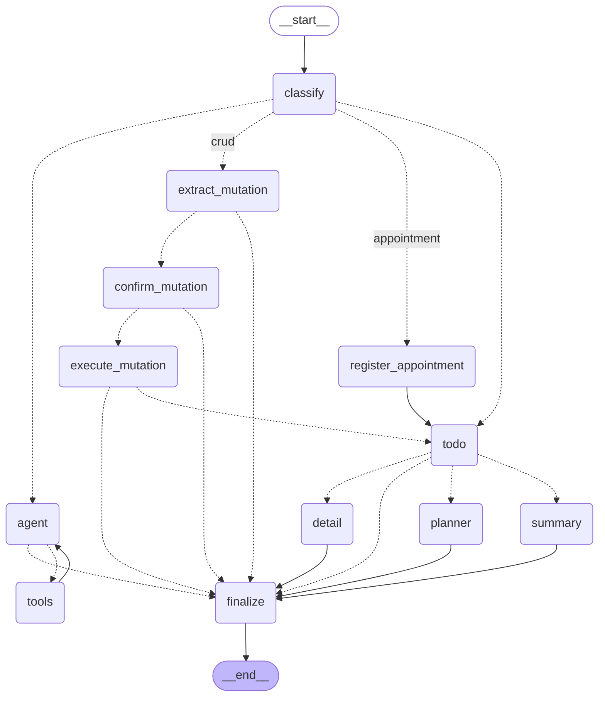

# To-do Agent — Kiến trúc & Hướng dẫn về Graph (Tiếng Việt)

Trợ lý quản lý công việc chạy hoàn toàn cục bộ: dùng model
[Ollama](https://ollama.com), lưu task qua một server
[MCP](https://modelcontextprotocol.io), suy luận bằng một graph đa tác tử
[LangGraph](https://langchain-ai.github.io/langgraph/), và giao diện chat
[Streamlit](https://streamlit.io).

Tài liệu này giải thích **cấu trúc dự án**, **các thành phần**, và — chi tiết
nhất — **graph lập kế hoạch**: từng node, từng cạnh (edge), và state chảy qua
chúng. Cuối tài liệu có mục **vì sao tách `appointment` khỏi `task`** (mục §7).

> Bản tiếng Anh: [ARCHITECTURE.md](ARCHITECTURE.md).

---

## 1. Bức tranh tổng thể

```
┌──────────────┐   prompt    ┌───────────────────────┐
│  Streamlit   │ ──────────► │   GraphOrchestrator    │   (LangGraph StateGraph)
│  chat UI     │             │  classify → … → final  │
│ (ui/*.py)    │ ◄────────── │  ⏸ tạm dừng xin duyệt  │
└──────────────┘  trả lời /  └───────────┬───────────┘
        ▲         xin duyệt               │ gọi
        │ bảng                            ▼
        │ review         ┌──────────────────────────────────┐
        └── duyệt/sửa ──►│ Các tác tử & năng lực             │
                         │  • TodoAgent     (đọc/chuẩn hoá)  │
                         │  • DailyPlanner  (lập lịch ngày)  │
                         │  • parser/executor CRUD           │
                         │  • vòng lặp agent gọi tool        │
                         └───────────┬───────────┬──────────┘
                                     │            │
                              ┌──────▼─────┐ ┌────▼──────┐
                              │ Ollama LLM │ │ MCP server│
                              │(llm_client)│ │  (tasks)  │
                              └────────────┘ └───────────┘
```

Hai ý tưởng cốt lõi giữ hệ thống đứng vững:

1. **Một hợp đồng dữ liệu có kiểu (typed contract)** — `models/contract.py` — là
   thứ duy nhất đi qua ranh giới giữa các tác tử. Văn bản tự do hay JSON chưa
   kiểm chứng không bao giờ chảy xuống dưới: một task sai định dạng sẽ **fail
   ngay tại ranh giới** thay vì làm hỏng kế hoạch.
2. **Luồng điều khiển là một graph.** Mỗi bước là một node, định tuyến là các
   cạnh, state chia sẻ là một `TypedDict`. Mọi thao tác ghi (mutation) đều bị
   **chặn để con người duyệt** qua cơ chế `interrupt` của LangGraph.

Có **hai orchestrator**:

| Orchestrator | File | Phong cách | Dùng bởi |
|---|---|---|---|
| `GraphOrchestrator` | `agents/graph_orchestrator.py` | `StateGraph` của LangGraph | **ứng dụng** (chế độ Planner) |
| `Orchestrator` | `agents/orchestrator.py` | `match` thuần Python | tham chiếu / test |

Cả hai dùng chung tác tử và hàm định dạng; chỉ khác phần "vỏ" điều khiển. Phần
dưới đây mô tả **graph orchestrator**.

---

## 2. Cấu trúc thư mục

```
src/
├── app.py                     # Điểm vào Streamlit: nạp skills + MCP tools, render UI
├── run_orchestrator.py        # CLI demo offline (task mẫu, tất định — không cần Ollama/MCP)
├── visualize_graph.py         # xuất graph ra Mermaid / ASCII / PNG
│
├── configs/
│   └── settings.py            # cấu hình theo biến môi trường (model, MCP URL, checkpoint DB, TRACE)
│
├── models/
│   ├── contract.py            # HỢP ĐỒNG: Task, TaskList, TaskMutation, DayPlan, …
│   └── skill.py               # dataclass Skill (name, description, body)
│
├── agents/
│   ├── graph_orchestrator.py  # graph đa tác tử LangGraph (trọng tâm tài liệu này)
│   ├── orchestrator.py        # hub-and-spoke + các factory + luật intent + hàm format
│   ├── todo_agent.py          # tác tử dữ liệu: fetch → chuẩn hoá → TaskList đã validate
│   ├── planner_agent.py       # tác tử suy luận: TaskList → DayPlan (+ planner LLM)
│   ├── human_in_the_loop.py   # bọc các tool ghi để bắt buộc xin duyệt
│   └── ollama_agent.py        # 1 agent gọi tool + skills (chế độ Streaming/Normal)
│
├── core/
│   ├── services/
│   │   ├── llm_client.py       # create_ollama_model(...) — factory ChatOllama
│   │   ├── mcp_client.py       # MultiServerMCPClient → tool LangChain
│   │   ├── checkpoint.py       # mở checkpointer (SQLite hoặc in-memory)
│   │   ├── prompts.py          # load_prompt("name") từ src/prompts/*.md
│   │   └── skills.py           # quét + nạp các file SKILL.md
│   └── tools/
│       ├── common_tools.py     # @tool cục bộ (vd: get_today_date, get_weather)
│       └── skill_tools.py      # tool get_skill_detail
│
├── ui/
│   ├── main_view.py            # chat, bảng review human-in-the-loop, streaming
│   └── sidebar.py              # chọn model / temperature / chế độ
│
├── prompts/                    # system prompt (markdown)
│   ├── intent_classifier_system.md
│   ├── todo_agent_system.md    # chuẩn hoá
│   ├── crud_agent_system.md    # phân tích mutation
│   ├── planner_agent_system.md # lập lịch ngày bằng LLM
│   ├── complex_agent_system.md # vòng lặp agent⇄tools
│   └── agent_system.md         # chế độ single-agent (ollama_agent)
│
└── utils/
    └── json_utils.py           # tiện ích JSON

tests/                          # bộ test pytest (contract, agents, graph, runtime)
```

---

## 3. Các thành phần cốt lõi

### 3.1 Hợp đồng — `models/contract.py`

Là "chốt" của hệ thống. Mọi model đều có kiểu, có biên (bounded) và
`extra="forbid"` (không cho phép trường lạ).

| Model | Vai trò |
|---|---|
| `Task` | Một công việc đã chuẩn hoá, sẵn sàng để xếp lịch: `id, title, priority, est_minutes (0<…≤480), category, due?`. |
| `TaskList` | Tập hợp đã validate, đi qua ranh giới TodoAgent → Planner. |
| `Priority` | enum `high / medium / low`, có `rank` để sắp xếp. |
| `Status` | `pending / in_progress / done` (khớp server MCP). |
| `CrudOp` | `create / update / delete`. |
| `TaskMutation` | Một yêu cầu ghi đã validate. `@model_validator` ép: create cần `title`; update/delete cần `task_id`; update cần ≥1 trường thay đổi. Đây là **điểm kiểm tra của luồng CRUD**. |
| `TimeBlock` / `MealBreak` / `DayPlan` | **Đầu ra** của planner ở dạng dữ liệu có kiểu: `blocks` đã xếp, `breaks`, `deferred`, kèm `available_minutes` và `overloaded`. |

### 3.2 Các tác tử

- **`TodoAgent`** (`todo_agent.py`) — *chuyên gia dữ liệu*. `run()` lấy task thô
  (qua fetcher tiêm vào, chạy trên MCP tools) rồi chuẩn hoá thành `TaskList` đã
  validate, thử lại khi output sai. `parse_mutation()` biến một yêu cầu ghi thành
  `TaskMutation` đã validate (LLM hoặc heuristic), nhận thêm `focus_task_id` để
  câu nói tiếp theo kiểu "đánh dấu nó xong" trỏ đúng task vừa nhắc.
- **`DailyPlannerAgent` / `plan_day` / `llm_plan_day`** (`planner_agent.py`) —
  *chuyên gia suy luận*. `plan_day` tất định: xếp hạng task, nhét vào khung giờ
  làm việc **xung quanh các break**, hoãn phần dư. `llm_plan_day` nhờ model sinh
  cả `DayPlan` (structured output) rồi validate (kiểu **và** ngữ nghĩa — trong
  khung giờ, không chồng lấn, mọi task đều được xếp hoặc hoãn). `make_planner`
  (trong `orchestrator.py`) bọc LLM kèm retry và **dự phòng tất định**, nên luôn
  trả về một kế hoạch hợp lệ. Ở đây cũng có: `parse_workday` ("tôi làm 7am–11pm"),
  `parse_appointment` ("ăn tối 17:30–19:30"), và `workday_with_appointments`.
- **Parser / executor mutation** (`orchestrator.py`) — `make_mutation_parser`
  sinh `TaskMutation`; `make_mutation_executor` áp dụng nó qua các MCP tool ghi
  (một update có thể chạm nhiều endpoint).
- **`human_in_the_loop.py`** — `wrap_mutating_tools` bọc mọi tool
  create/update/delete để `interrupt` xin duyệt trước khi chạy (dùng cho nhánh
  agent loop).

### 3.3 Dịch vụ & tool

- `llm_client.create_ollama_model(name, temperature, format=schema, …)` — nơi
  duy nhất tạo model; `format` bật chế độ structured output.
- `mcp_client` — kết nối server MCP và trả về tool LangChain.
- `checkpoint.make_checkpointer_opener(db)` — saver SQLite bền vững (hoặc
  in-memory cho test). Bắt buộc để interrupt/resume hoạt động.
- `prompts.load_prompt(name)` — đọc `src/prompts/<name>.md`.
- `skills` + `skill_tools` + `common_tools` — skills theo lối "tiết lộ dần"
  (progressive disclosure) và các tool cục bộ nhỏ.

### 3.4 Giao diện

`app.py` nạp skills + MCP tools rồi gọi `ui/main_view.render_main_view`.
Ở **chế độ Planner**, main view điều khiển `GraphOrchestrator.start/resume`. Khi
graph dừng để xin duyệt, nó render một **bảng review có thể chỉnh sửa**
(`_render_approval_panel`): create hiện mọi trường, update chỉ hiện trường bị đổi,
delete chỉ xác nhận; các chỉnh sửa được validate theo `TaskMutation` trước khi
resume, và khung chat bị khoá cho tới khi review xong.

---

## 4. Graph

### 4.1 State chia sẻ — `PlannerState`

`TypedDict` chảy qua mọi cạnh:

| Trường | Ý nghĩa | Vòng đời |
|---|---|---|
| `user_input` | prompt hiện tại | theo lượt |
| `date` | ngày hôm nay (ISO) | theo lượt |
| `intent` | kết quả phân loại (xem §4.4) | theo lượt |
| `tasks` | `TaskList` đã validate, ở dạng dict thuần | theo lượt |
| `mutation` | `TaskMutation` đã validate, ở dạng dict thuần | theo lượt |
| `approved` | quyết định của người dùng từ `confirm_mutation` | theo lượt |
| `notice` | dòng thông báo thành công, ghép trước kết quả | theo lượt |
| `result` | văn bản hiển thị cho người dùng | theo lượt |
| `error` | thông báo lỗi có thể phục hồi | theo lượt |
| `messages` | log chat chỉ-thêm (`add_messages`) — bộ nhớ hội thoại | **bền** |
| `focus_task` | `{id,title}` của task vừa xem/tác động | **bền** |
| `appointments` | danh sách `{name,start,end}` các cam kết cố định giờ | **bền** |
| `work_hours` | `{start,end}` khung giờ làm việc gần nhất | **bền** |

`start()` reset các trường "theo lượt" mỗi lần; bốn trường **"bền"** thì **không**
bị reset, nên chúng đi xuyên qua các lượt nhờ checkpointer (khoá theo
`thread_id`). Đó là lý do "đổi category của nó", "lập lại lịch hôm nay", và bữa
tối đã ghi nhớ hoạt động liền mạch.

### 4.2 Sơ đồ graph

```
                            ┌──────────┐
                START ─────►│ classify │
                            └────┬─────┘
                   route_by_intent│
   ┌───────────────┬─────────────┼──────────────┬────────────────────┐
   │ appointment   │ plan/summary │ add/update/   │ complex/unknown/   │
   │               │ /detail      │ delete (crud) │ weather            │
   ▼               ▼              ▼               ▼
┌──────────────┐  ┌──────┐   ┌───────────────┐  ┌───────┐
│ register_    │  │ todo │   │extract_mutation│  │ agent │◄────┐
│ appointment  │  └──┬───┘   └──────┬────────┘  └──┬────┘     │
└──────┬───────┘     │ route_after_  │route_after_  │ should_   │tools→agent
       │ (cạnh)      │ todo          │extract       │ continue  │ (vòng lặp)
       └────────────►│               │              │           │
                     │     ┌─────────┴───┐    ┌─────┴────┐  ┌────┴───┐
        ┌────────────┼─────┤             │    │ còn tool │  │ tools  │
        │ summary    │ detail            ▼    │ call?    ├─►│(ToolNode)
        ▼            ▼     │     ┌──────────────┐         │  └────────┘
   ┌────────┐  ┌────────┐ │     │confirm_       │ ⏸ interrupt
   │summary │  │ detail │ │     │mutation       │ (con người duyệt)
   └───┬────┘  └───┬────┘ │     └──────┬───────┘
       │           │      │ route_after_confirm
       │       ┌───▼──────▼─┐   ┌──────┴───────┐
       │       │  planner   │   │              ▼
       │       └─────┬──────┘   │       ┌──────────────┐
       │             │          │       │execute_      │ route_after_execute
       │             │          │       │mutation      ├───► todo (thành công → lập lại lịch)
       │             │          │       └──────┬───────┘
       └─────────────┴──────────┴──────────────┴──► ┌──────────┐
              (các nhánh lỗi cũng về đây)            │ finalize │──► END
                                                     └──────────┘
```

#### Sơ đồ tự sinh (Mermaid)

Khối dưới đây **xuất trực tiếp từ graph** bằng `python src/visualize_graph.py`
(GitHub render được ngay). Cạnh nét đứt `-.->` là cạnh điều kiện (định tuyến);
nét liền `-->` là cạnh trực tiếp. Để xuất file: `--out docs/planner_graph` tạo
`docs/planner_graph.mmd`; ảnh PNG cần mạng (mermaid.ink) hoặc dán nội dung vào
<https://mermaid.live>.



### 4.3 Các node — từng node làm gì (giải thích từng bước)

| Node | Hàm | Trách nhiệm |
|---|---|---|
| **classify** | `classify` | Ghi log prompt và quyết định `intent` (xem §4.4). Thuần định tuyến — không tác động dữ liệu. |
| **register_appointment** | `register_appointment` | Phân tích cam kết cố định giờ từ prompt, thêm vào `appointments` (chống trùng), đặt `notice`. Sau đó chảy vào `todo` để lập lại lịch. **Không bao giờ tạo task.** |
| **todo** | `run_todo` | Chạy `TodoAgent.run()` → `TaskList` đã validate (lưu dạng dict). Nếu `ContractError` thì đặt `error`. Là bước đọc dùng chung cho plan/summary/detail và việc lập-lại-lịch sau CRUD. |
| **planner** | `run_planner` | Dựng `Workday` hiệu lực: chỉ phân tích giờ làm việc từ prompt **khi** `intent == "plan"`, ngược lại tái dùng `work_hours`/mặc định; gộp `appointments`; rồi gọi `planner` đã tiêm (LLM + dự phòng). Sinh `result` (và lưu `work_hours`). |
| **summary** | `run_summary` | Render toàn bộ `TaskList` thành văn bản (`format_summary`). |
| **detail** | `run_detail` | Khớp prompt với **một** task (`_match_task`) và render các trường của nó; ghi nhớ làm `focus_task`. |
| **extract_mutation** | `extract_mutation` | Phân tích yêu cầu ghi thành `TaskMutation` đã validate (truyền `focus_task` làm tham chiếu dự phòng). Thành công thì ghi task mục tiêu làm `focus_task`; `ContractError` thì đặt `error`. |
| **confirm_mutation** | `confirm_mutation` | **Nơi `interrupt` duy nhất.** Hiển thị thay đổi đề xuất để con người duyệt. Khi resume trả về `approved` (accept), `mutation` đã sửa+validate lại (edit), hoặc thông báo từ chối. |
| **execute_mutation** | `execute_mutation` | Áp dụng mutation đã duyệt qua các MCP tool ghi. Thành công đặt `✅ notice`, thất bại đặt `error`. |
| **agent** | `agent` | Nhánh mở: một LLM gắn mọi tool (đọc MCP, `plan_my_day`, `summarize_tasks`, common tools, và tool ghi đã **bọc duyệt**) quyết định lời gọi tool tiếp theo. |
| **tools** | `ToolNode(agent_tools)` | Thực thi các lời gọi tool agent phát ra. Tool ghi đã bọc sẽ `interrupt` tại đây để xin duyệt. |
| **finalize** | `finalize` | Sinh `result` cuối (ghép `notice` nếu có), và thêm câu trả lời của trợ lý vào `messages` (bộ nhớ) cho các nhánh tất định. |

### 4.3.1 Node hoạt động thế nào & có dùng LLM không

Ký hiệu: **🤖 = có gọi LLM**, **⚙️ = thuần code tất định (không LLM)**.
Tóm tắt nhanh:

| Node | LLM? | Ghi chú |
|---|---|---|
| classify | 🤖 *có điều kiện* | Chỉ gọi LLM khi từ khoá ra `unknown` |
| register_appointment | ⚙️ | regex parse |
| todo | 🤖 *khi `use_llm`* | chuẩn hoá bằng LLM, dự phòng heuristic |
| planner | 🤖 *khi `use_llm`* | lập lịch bằng LLM, dự phòng `plan_day` |
| summary | ⚙️ | ghép chuỗi |
| detail | ⚙️ | so khớp tên + format |
| extract_mutation | 🤖 *khi `use_llm`* | phân tích bằng LLM, dự phòng heuristic |
| confirm_mutation | ⚙️ (con người) | `interrupt` xin duyệt |
| execute_mutation | ⚙️ | gọi MCP write tools |
| agent | 🤖 *luôn* | LLM gọi tool |
| tools | ⚙️ | thực thi tool call |
| finalize | ⚙️ | ghép kết quả |

Chi tiết từng node:

- **classify** — 🤖 *có điều kiện*. Chạy lần lượt: (1) `parse_appointment`
  (regex) ⚙️ → `appointment`; (2) `wants_detail` (từ khoá) ⚙️ → `detail`;
  (3) `matched_intent_families` > 1 ⚙️ → `complex`; (4) `classify_intent` (từ
  khoá) ⚙️ → nhãn; (5) **chỉ khi** nhãn là `unknown` **và** `use_llm` mới gọi
  `llm_classify_intent` 🤖 (1 lần, tự quay về từ khoá nếu model lỗi). → Phần lớn
  tất định; LLM là "phao cứu sinh" cho câu chữ tự nhiên không có từ khoá.

- **register_appointment** — ⚙️. `parse_appointment` (regex) lấy tên + giờ, thêm
  vào `appointments` (chống trùng), đặt `notice`. Không LLM.

- **todo** (`run_todo`) — 🤖 *khi `use_llm`*. Gọi `TodoAgent.run()`:
  `_fetch_raw()` lấy task thô từ **MCP** (không LLM) → `normalize`: nếu `use_llm`
  thì `llm_normalize` 🤖 biến dữ liệu thô lộn xộn thành `TaskList` chuẩn (suy ra
  `est_minutes`, `category`…), **có retry**; nếu lỗi/model chết thì rơi về
  `heuristic_normalize` ⚙️. Nếu `use_llm=False` thì dùng heuristic ngay.
  Output: `tasks` (dict) hoặc `error`.

- **planner** (`run_planner`) — 🤖 *khi `use_llm`* + dự phòng ⚙️. Dựng workday:
  `parse_workday` (regex, **chỉ khi** `intent==plan`) + `workday_with_appointments`
  ⚙️. Rồi gọi `planner` (`make_planner`): thử `llm_plan_day` 🤖 (sinh `DayPlan`
  structured + validate kiểu/ngữ nghĩa + retry); nếu thất bại/không gọi được →
  `plan_day` ⚙️ tất định. Output: `result`.

- **summary** (`run_summary`) — ⚙️. `format_summary` chỉ duyệt `TaskList` và ghép
  chuỗi. Không LLM.

- **detail** (`run_detail`) — ⚙️. `_match_task` so khớp tên trong prompt với task
  + `format_detail`; ghi nhớ `focus_task`. Không LLM.

- **extract_mutation** — 🤖 *khi `use_llm`* + dự phòng ⚙️. `_fetch_raw` lấy task
  hiện tại (MCP) → `parse_mutation` (`make_mutation_parser`): `use_llm` thì
  `llm_parse_mutation` 🤖 (sinh `TaskMutation` structured + retry); lỗi →
  `heuristic_parse_mutation` ⚙️. Có truyền `focus_task_id` làm tham chiếu dự
  phòng. Output: `mutation` (dict) hoặc `error`.

- **confirm_mutation** — ⚙️ (do **con người**, không LLM). `interrupt` đẩy thay
  đổi ra cho người dùng; khi resume thì validate `TaskMutation`. Quyết định đến
  từ người dùng, không phải model.

- **execute_mutation** — ⚙️. Gọi các **MCP write tool** qua `mutation_executor`
  (một update có thể chạm nhiều endpoint). Không LLM.

- **agent** — 🤖 *luôn dùng LLM*. `llm_with_tools.invoke([System, *messages])` —
  model quyết định gọi tool nào tiếp theo. (Nếu `use_llm=False` thì trả
  `_UNKNOWN_MSG`, không LLM.)

- **tools** (`ToolNode`) — ⚙️ (bản thân không LLM). Thực thi các tool call agent
  phát ra. Lưu ý gián tiếp: tool `plan_my_day` bên trong gọi `planner` (có thể
  dùng LLM), `summarize_tasks` thì không; tool ghi đã bọc sẽ `interrupt` để duyệt.

- **finalize** — ⚙️. Ghép `notice` + `result`, thêm câu trả lời vào `messages`.
  Không LLM.

> **Điểm mấu chốt:** "trí tuệ" LLM nằm ở **node** (chuẩn hoá, lập lịch, phân tích
> mutation, agent, và bước fallback của classify). Mọi **cạnh/router** đều là code
> thuần (xem §4.5.1).

### 4.4 Phân loại ý định (bên trong `classify`) — kiểm tra theo thứ tự

Kiểm tra **lần lượt** — khớp đầu tiên thắng:

1. `parse_appointment(prompt)` khớp → **`appointment`** (có khoảng thời gian +
   từ khoá sự kiện như *ăn tối/họp*, và không phải câu nói về "work").
2. `wants_detail(prompt)` → **`detail`** (vd *"cho tôi xem chi tiết task X"*).
   Giải quyết trước summary để *"cho tôi xem"* không cướp mất.
3. Có **nhiều hơn một họ từ khoá** khớp → **`complex`** (đa bước; vào agent loop).
4. Ngược lại `classify_intent(prompt)` (luật từ khoá) →
   `plan / summary / add / update / delete / weather / unknown`.
5. **Dự phòng LLM (hybrid):** nếu luật từ khoá trả `unknown` (và `use_llm`), gọi
   `llm_classify_intent` để phân loại câu chữ tự nhiên không có từ khoá. Nó dùng
   prompt `intent_classifier_system` và **tự quay về luật từ khoá khi lỗi**, nên
   prompt rõ ràng vẫn nhanh/tất định, chỉ câu mơ hồ mới tốn một lượt gọi model.

`route_by_intent` ánh xạ nhãn → node bắt đầu:

| Intent | Node đầu |
|---|---|
| `appointment` | `register_appointment` |
| `plan`, `summary`, `detail` | `todo` |
| `add`, `update`, `delete` | `extract_mutation` (luồng CRUD) |
| `complex`, `weather`, `unknown`, còn lại | `agent` |

### 4.5 Các cạnh — từng chuyển tiếp

| Từ | Loại | Router | Đích |
|---|---|---|---|
| `START` | trực tiếp | — | `classify` |
| `classify` | điều kiện | `route_by_intent` | `register_appointment` \| `todo` \| `extract_mutation` \| `agent` |
| `register_appointment` | trực tiếp | — | `todo` |
| `todo` | điều kiện | `route_after_todo` | `error→finalize`; `summary→summary`; `detail→detail`; còn lại `→planner` |
| `extract_mutation` | điều kiện | `route_after_extract` | `error→finalize`; còn lại `→confirm_mutation` |
| `confirm_mutation` | điều kiện | `route_after_confirm` | `approved→execute_mutation`; còn lại `→finalize` (bị từ chối) |
| `execute_mutation` | điều kiện | `route_after_execute` | `error→finalize`; còn lại `→todo` (thành công → **lập lại lịch**) |
| `planner` | trực tiếp | — | `finalize` |
| `summary` | trực tiếp | — | `finalize` |
| `detail` | trực tiếp | — | `finalize` |
| `agent` | điều kiện | `should_continue` | `còn tool call→tools`; còn lại `→finalize` |
| `tools` | trực tiếp | — | `agent` (**vòng lặp ReAct quay lại**) |
| `finalize` | trực tiếp | — | `END` |

Hai vòng lặp đáng chú ý:

- **Vòng ReAct**: `agent → tools → agent → …`, chặn bởi `recursion_limit` (25).
  Quyết định lặp tiếp nằm ở cạnh `should_continue`.
- **Vòng lập-lại-lịch sau CRUD**: `execute_mutation → todo → planner → finalize`:
  sau khi ghi thành công, ngày được lập lại để người dùng thấy hiệu quả.

### 4.5.1 Từng conditional edge định tuyến thế nào (chi tiết)

> **Quan trọng:** mọi router đều là **hàm Python thuần (⚙️, KHÔNG dùng LLM)**.
> Chúng chỉ **đọc state** rồi chọn node kế tiếp. Nhưng state mà chúng đọc có thể
> **do một node LLM sinh ra** — ví dụ `intent` có thể do LLM đặt (bước 5 của
> classify), `tool_calls` do LLM của node `agent` sinh. Tức là *quyết định rẽ
> nhánh* có thể bắt nguồn từ LLM, còn *bản thân việc rẽ* thì tất định.

- **`route_by_intent`** (sau `classify`) — đọc `state["intent"]`:
  `appointment → register_appointment`; `plan/summary/detail → todo`;
  `add/update/delete → extract_mutation` (nhãn "crud"); còn lại
  (`complex/weather/unknown`) `→ agent`. ⚙️. *(`intent` có thể do LLM đặt.)*

- **`route_after_todo`** (sau `todo`) — nếu `state["error"]` (chuẩn hoá thất bại)
  `→ finalize`; nếu `intent==summary` `→ summary`; nếu `intent==detail`
  `→ detail`; còn lại (plan, appointment, lập-lại-lịch sau CRUD) `→ planner`. ⚙️.

- **`route_after_extract`** (sau `extract_mutation`) — `state["error"]`
  `→ finalize` (không phân tích được yêu cầu ghi); ngược lại `→ confirm_mutation`
  (đi xin duyệt). ⚙️.

- **`route_after_confirm`** (sau `confirm_mutation`) — `state["approved"]` là True
  `→ execute_mutation`; False/từ chối `→ finalize`. ⚙️. *(Giá trị `approved` đến
  từ CON NGƯỜI qua interrupt/resume, không phải LLM.)*

- **`route_after_execute`** (sau `execute_mutation`) — `state["error"]`
  `→ finalize` (ghi thất bại); thành công `→ todo` để **lập lại lịch** cho người
  dùng thấy hiệu quả. ⚙️.

- **`should_continue`** (sau `agent`) — lấy message cuối: nếu còn `tool_calls`
  `→ tools`; nếu không `→ finalize`. ⚙️ **nhưng** quyết định "còn gọi tool nữa
  không" là do **LLM của node `agent`** sinh ra — đây chính là động cơ của vòng
  lặp ReAct `agent → tools → agent`.

### 4.6 Con người trong vòng lặp (interrupt / resume)

Có **hai** điểm duyệt, đều tạm dừng graph bằng `interrupt`:

1. **`confirm_mutation`** (luồng CRUD tất định). Payload mang `TaskMutation` đề
   xuất. UI render bảng review; người dùng accept/edit/reject.
   `GraphOrchestrator.resume(thread_id, decision)` đưa quyết định trở lại và node
   chạy tiếp.
2. **Tool ghi đã bọc duyệt** trong node `tools` (nhánh agent loop). Mọi tool
   create/update/delete mà agent gọi đều bị `add_human_in_the_loop` bọc, nên
   interrupt trước khi thực thi.

Resume cần **checkpointer** và `thread_id` ổn định — chính `thread_id` cũng cấp
bộ nhớ cho hội thoại.

### 4.7 Chi tiết lập lịch

- **LLM + dự phòng có validate.** `run_planner` → `make_planner`: thử
  `llm_plan_day` (DayPlan structured, có retry), validate kiểu **và** ngữ nghĩa
  (`_validate_plan`: block trong khung giờ, không chồng lấn block khác hay
  break/appointment, task_id hợp lệ, mọi task đều được xếp hoặc hoãn). Nếu thất
  bại nhiều lần hoặc model không gọi được, quay về `plan_day` tất định.
- **Giờ làm việc** ("tôi làm 7am–11pm") chỉ được phân tích khi `plan` rõ ràng,
  lưu vào `work_hours`, và tái dùng cho các lần lập lại lịch sau.
- **Cam kết cố định giờ** ("ăn tối với gia đình 17:30–19:30") lưu trong
  `appointments`, gộp vào workday như block cố định (thay break ăn mặc định nếu
  trùng), và được cả hai planner xếp xung quanh.

---

## 5. Các luồng đầu-cuối

| Bạn nói | Đường đi qua graph |
|---|---|
| "lập lịch hôm nay, tôi làm 7am–11pm" | `classify(plan) → todo → planner → finalize` |
| "tôi có gì trong danh sách?" | `classify(summary) → todo → summary → finalize` |
| "cho tôi xem chi tiết task Design API" | `classify(detail) → todo → detail → finalize` |
| "tôi có bữa tối với gia đình 17:30–19:30" | `classify(appointment) → register_appointment → todo → planner → finalize` |
| "thêm task gọi điện cho ngân hàng" | `classify(add) → extract_mutation → confirm_mutation ⏸ → execute_mutation → todo → planner → finalize` |
| "xoá task Gym" rồi từ chối | `classify(delete) → extract_mutation → confirm_mutation ⏸ → finalize` |
| "lập lịch VÀ thêm một task" | `classify(complex) → agent ⇄ tools (vòng lặp) → finalize` |

---

## 6. Chạy & quan sát

- **App (chế độ Planner):** `streamlit run src/app.py`
- **Trace từng node + state:** `PLANNER_TRACE=1 streamlit run src/app.py`
  (ghi ra terminal; cũng bật được qua `.env`).
- **CLI demo offline:** `python src/run_orchestrator.py "plan my day"`
  (task mẫu + chuẩn hoá tất định; có cờ `--trace`, `--day-end`; không cần
  Ollama/MCP).
- **Vẽ graph:** `python src/visualize_graph.py`
  (`draw_mermaid()` / `draw_ascii()` / `save_visualization()`).
- **Cấu hình:** `src/configs/settings.py` (biến: `OLLAMA_MODEL`, `TASK_MCP_URL`,
  `CHECKPOINT_DB`, `PLANNER_TRACE`, …).
- **Test:** `uv run pytest -q`.

---

## 7. Vì sao tách `appointment` riêng, thay vì gộp chung vào `task`?

Đây là một quyết định thiết kế quan trọng. Tóm gọn: **`task` và `appointment`
trả lời hai câu hỏi khác nhau**, nên để chung sẽ làm bẩn mô hình và sinh lỗi.

- **Task (việc linh hoạt)** trả lời: *"khi nào nên làm việc này?"* — nó có
  `est_minutes` (thời lượng) nhưng **không** có thời điểm cố định, để planner tự
  do đặt vào chỗ trống.
- **Appointment (cam kết cố định giờ)** nói: *"khoảng giờ 17:30–19:30 đã bị
  chiếm."* — nó là **ràng buộc**, không phải việc cần xếp.

Dưới đây là các lý do cụ thể.

### 7.1 Ngữ nghĩa khác nhau → nếu gộp, mọi nơi phải phân nhánh "có giờ / không giờ"

`Task` trong contract chỉ có `id, title, priority, est_minutes, category, due`.
Để nhồi appointment vào, ta phải thêm trường tuỳ chọn `fixed_start/fixed_end`.
Hậu quả: **mọi đoạn code dùng `Task`** (ranh giới hợp đồng, ranking, hai planner,
hàm format, validate) đều phải xử lý hai biến thể — "task có giờ cố định" và
"task linh hoạt". `extra="forbid"` và các ràng buộc có biên (bounded) đang cho ta
"validate miễn phí"; thêm trường tuỳ chọn sẽ làm yếu chính các bất biến đó.

### 7.2 Kho dữ liệu MCP (bên ngoài) không lưu được thời điểm

Task trong MCP store chỉ có `due_date, est, priority, status, category` — **không
có trường giờ bắt đầu/kết thúc**. Nếu coi appointment là task, sẽ rơi vào một
trong hai:

- **mất thông tin giờ** — đúng như lỗi ban đầu: "ăn tối 17:30–19:30" bị lưu thành
  một task 120 phút, ưu tiên cao, mất hẳn mốc 17:30–19:30; khi xem lại task thì
  không có giờ; hoặc
- **phải sửa server MCP** — nằm ngoài tầm kiểm soát của ứng dụng.

Vì vậy appointment được giữ ở **tầng planner / state phiên làm việc**, không ghi
vào store.

### 7.3 Trong planner, appointment giống "break" hơn là "task"

Bộ lập lịch **đã sẵn** cơ chế xếp việc **xung quanh các break cố định** (lunch,
dinner). Một appointment chính là một break do người dùng định nghĩa. Tái dùng cơ
chế này gọn và an toàn:

- `workday_with_appointments` biến mỗi appointment thành một `Break`, và **thay
  thế break ăn mặc định** nếu trùng giờ (nên bữa tối 17:30–19:30 thay cho khung
  ăn tối mặc định 18:00–19:00 thay vì đặt chồng).
- `_validate_plan` đảm bảo **không task nào đè lên** break/appointment — kể cả khi
  LLM "quên" nó trong output (nguồn sự thật là `workday.breaks`).

Nếu coi là task: planner sẽ cố "xếp" nó vào chỗ trống (dễ sai giờ — đúng như
trace trước đó liên tục đặt "Dinner with family" ra ngoài khung giờ rồi bị
validate loại), hoặc tệ hơn là chồng giờ.

### 7.4 Khi quá tải (overload), appointment KHÔNG được hoãn

`plan_day` hoãn (defer) các task ưu tiên thấp khi ngày quá tải. Nhưng **không thể
"hoãn" bữa tối gia đình** — nó là cam kết cứng. Tách riêng đảm bảo appointment
không bao giờ lọt vào danh sách `deferred`; nó luôn chiếm đúng khoảng giờ của
mình, còn task thì mới là thứ bị co giãn/hoãn.

### 7.5 Phân loại ý định sạch hơn, không tạo "task rác"

"tôi có bữa tối với gia đình 17:30–19:30" → intent `appointment` → đăng ký + lập
lại lịch, **không** tạo task. Trước khi tách, câu này rơi vào `agent` loop và tự
tạo một task sai (120 phút, High, Personal). Tách `appointment` ngay từ bước
`classify` loại bỏ hành vi sai đó.

### 7.6 Bền vững theo ngữ cảnh hội thoại

`appointments` nằm trong state **bền** (qua các lượt). Nhờ vậy "lập lại lịch hôm
nay" vẫn giữ bữa tối, và có thể tích luỹ nhiều cam kết trong ngày — tách bạch
hẳn với danh sách task lấy từ store.

### Tóm tắt đối chiếu

| Tiêu chí | `task` (linh hoạt) | `appointment` (cố định giờ) |
|---|---|---|
| Có thời điểm cố định? | Không (chỉ có `est_minutes`) | Có (`start`–`end`) |
| Ai quyết định giờ? | Planner | Người dùng |
| Bị hoãn khi quá tải? | Có thể | **Không** |
| Lưu ở đâu? | MCP store | State phiên (planner) |
| Vai trò khi lập lịch | Việc cần xếp | Ràng buộc / "break" |
| Hợp đồng | `Task` / `TaskMutation` | `Break` qua `appointments` |
